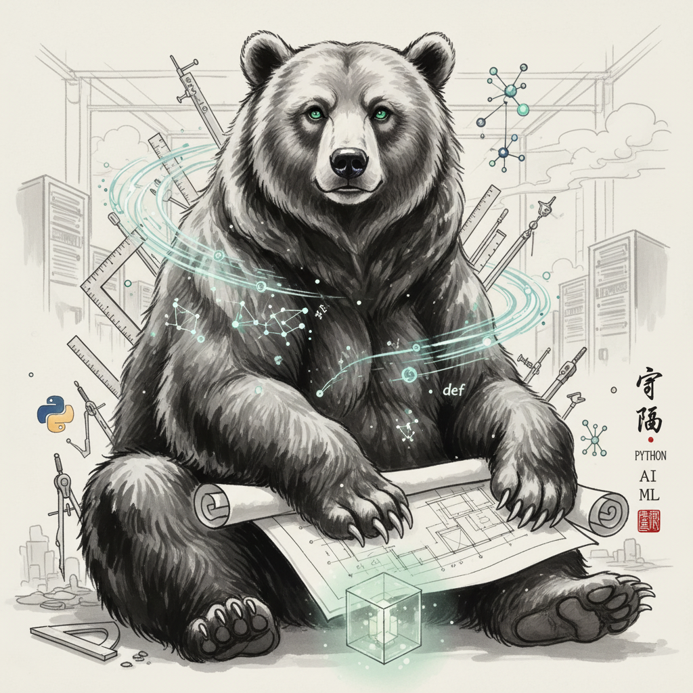

# Git-to-Image: GitHub Profile Portrait Generator

A Nano Banana Hackathon project that analyzes GitHub user profiles and generates artistic portrait prompts based on coding style, contributions, and technical focus areas.


## 🎯 Features

- **Multi-dimensional GitHub Analysis**: Language distribution, domain focus, contribution patterns, and commit timing
- **AI-Powered Domain Classification**: Uses Google Gemini to analyze repository content
- **Artistic Style Mapping**: Converts technical attributes to visual elements (characters, styles, backgrounds)
- **Prompt Generation**: Creates detailed image generation prompts with variations
- **CLI Interface**: Interactive and command-line modes for easy use

## 🚀 Quick Start

1. **Install dependencies**:
   ```bash
   uv add PyGithub google-generativeai requests
   ```

2. **Set up API keys**:
   ```bash
   export GITHUB_TOKEN="your_github_token"
   export GEMINI_API_KEY="your_gemini_api_key"
   ```

3. **Run the tool**:
   ```bash
   # Interactive mode (guided experience)
   python cli.py
   
   # Analyze specific user (profile only)
   python cli.py -u phunterlau -p
   
   # Generate single image for user
   python cli.py -u phunterlau
   
   # Batch process multiple users
   python cli.py -b user1 user2 user3
   ```

## 🎨 Image Generation Features

- **Real Image Generation**: Uses Google Gemini's image API to create actual PNG images
- **Session ID Tracking**: All images in a session get a unique timestamp-based ID
- **Multiple Variations**: Generate main prompt plus artistic variations with different randomness levels
- **Batch Generation**: Create all variations for a user in one session
- **Fallback Support**: Saves prompts as text files if image generation fails

## 📊 Analysis Dimensions

### Language Analysis
- Analyzes programming language distribution across repositories
- Identifies primary coding languages and their percentages

### Domain Focus
- AI-powered analysis of repository content using Gemini
- Classifies projects into domains: AI/ML, Web Frontend/Backend, Game Dev, etc.

### Contribution Style
- **Solo Creator**: Primarily works on own repositories
- **Collaborator**: Active in team projects with frequent collaboration
- **Architect**: Focus on structure, documentation, and project organization
- **Refined Developer**: Careful, polished commits with good practices

### Commit Cadence
- **Activity Level**: Casual, Regular, or Intensive based on commit frequency
- **Time Patterns**: Morning Person, Day Coder, Night Owl, or Flexible
- **Schedule**: Weekday Developer, Weekend Warrior, or Always On

## 🎨 Style Mapping

The system maps technical attributes to artistic elements:

- **Programming Languages** → **Art Styles** (e.g., Python → Futuristic, C → Retro)
- **Domain Focus** → **Backgrounds** (e.g., AI/ML → Neural Networks, Web → Digital Cityscape)
- **Contribution Style** → **Character Animals** (e.g., Solo Creator → Wise Owl, Collaborator → Social Dolphin)
- **Activity Patterns** → **Lighting & Atmosphere** (e.g., Day Coder → Bright Sunlight)

## 📁 Project Structure

```
.
├── frontend/
│   ├── app.py              # Main Streamlit UI application
│   ├── run_ui.py           # Startup script for the UI
│   ├── requirements.txt    # Frontend Python dependencies
│   └── README.md           # Frontend documentation
│
├── git_to_image/
│   ├── main.py             # Main CLI entry point
│   ├── github_analyzer.py  # GitHub API interactions and analysis
│   ├── image_generator.py  # Text-to-Image generation logic
│   ├── image_to_image_generator.py # Image-to-Image generation logic
│   ├── prompt_generator.py # AI prompt engineering
│   └── style_guide.py      # Artistic style mappings
│
├── generated_images/       # Output for generated PNGs and prompts
├── user_profile/           # Cached JSON profiles of analyzed users
├── profile_pictures/       # Downloaded GitHub profile pictures
│
└── README.md               # This file
```

## 🔍 Example Output

For user `phunterlau`:
- **Primary Language**: Python (53.3%)
- **Focus Areas**: AI/ML, Cybersecurity, Web Frontend  
- **Contribution Style**: Solo Creator
- **Activity**: Casual Day Coder

**Generated Character**: Wise Owl in Futuristic Cyberpunk style with Neural Network background

## 🤖 AI Integration

- **GitHub Analysis**: Uses PyGithub for comprehensive profile data
- **Domain Classification**: Google Gemini analyzes README content for accurate domain identification
- **Cost Tracking**: Built-in token usage and cost estimation for API optimization

## 🎯 Nano Banana Hackathon

This project was developed for the Nano Banana Hackathon with the goal of creating a unique developer portrait generator that captures both technical skills and working patterns in artistic form.

## 🛠️ Development

The project follows a phased development approach:
1. **Phase 1**: GitHub data foundation and AI-powered analysis
2. **Phase 2**: Style guide implementation and prompt generation  
3. **Phase 3**: CLI interface and user experience

## 📝 Usage Examples

```bash
# Interactive mode - guided experience
python cli.py

# Quick profile analysis
python cli.py -u octocat -p

# Generate portrait prompt
python cli.py -u torvalds

# Batch processing
python cli.py -b octocat torvalds gvanrossum

# Force refresh cached profiles
python cli.py -u phunterlau --force-refresh
```

## 🎨 Image Generation

The tool generates detailed prompts that can be used with:
- Google Gemini (Imagen)
- OpenAI DALL-E
- Midjourney
- Stable Diffusion
- Any text-to-image generator

Prompts are saved as `.txt` files in the `generated_images/` directory.

---

**Built with ❤️ for the Nano Banana Hackathon**
